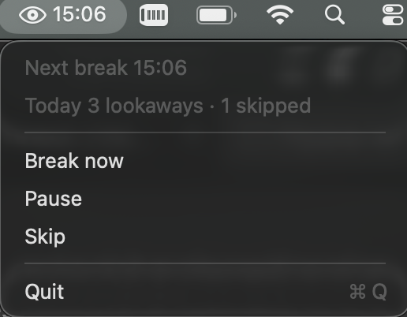
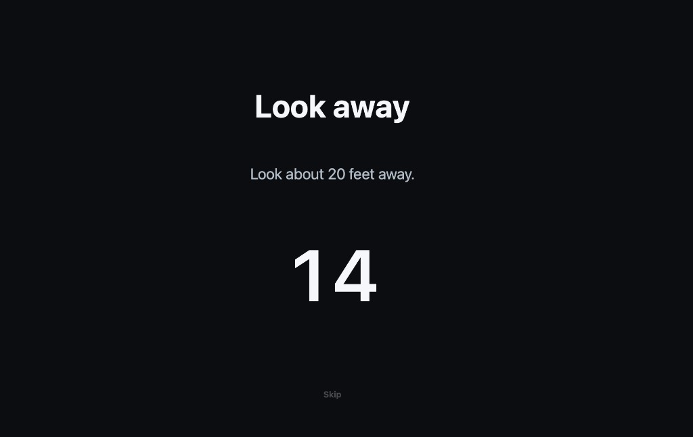

# Lookaway

Every 20 minutes, the screen locks so you look ~20 feet away for 20 seconds.

<p align="center">
  <br>
  The little eye in the menu bar. Time until the next break.
</p>

<p align="center">
  <br>
  Click it for Break now, Pause, Skip, and today’s lookaways.
</p>

<p align="center">
  <br>
  Every 20 minutes this takes the screen. Look about 20 feet away.
</p>

I built this because I sit on a laptop all day and my eyes get fried. Notifications were too easy to swipe away. I wanted something that actually takes the screen for 20 seconds.

The 20-20-20 rule: every 20 minutes, look 20 feet away for 20 seconds. The [American Optometric Association (AOA)](https://www.aoa.org/healthy-eyes/eye-and-vision-conditions/computer-vision-syndrome) and the [American Academy of Ophthalmology (AAO)](https://www.aao.org/eye-health/tips-prevention/computer-usage) recommend it for digital eye strain. A 2023 study found it eased symptoms; it is not a cure.

[Download](https://github.com/adesokanayo/lookaway/releases/latest)

**Mac** — open the DMG and run `Install Lookaway.command` (or drag the app to Applications). The installer quits any already-running copy so you do not get two timers. Apple will warn it is unsigned. System Settings → Privacy & Security → Open Anyway. Or: `xattr -cr /Applications/Lookaway.app` then open it.

**Windows** — unzip, run `Lookaway.exe`. Icon sits in the tray. SmartScreen: More info → Run anyway.

Unlocking the machine (or waking from sleep) starts a fresh 20 minutes. Lock-screen time does not count.

**Gophers**

```bash
go install github.com/adesokanayo/lookaway@latest
lookaway
```

Mac needs Xcode CLT (`xcode-select --install`). Windows: `CGO_ENABLED=0 go install github.com/adesokanayo/lookaway@latest`.

```bash
git clone https://github.com/adesokanayo/lookaway.git
cd lookaway
go test ./...
go run .
```

```bash
LOOKAWAY_WORK=30s LOOKAWAY_BREAK=20s go run .
./scripts/package-dmg.sh
./scripts/package-windows.sh
```

MIT. PRs welcome.

## References

1. American Optometric Association. Computer vision syndrome. https://www.aoa.org/healthy-eyes/eye-and-vision-conditions/computer-vision-syndrome
2. American Academy of Ophthalmology. Computers, digital devices, and eye strain. https://www.aao.org/eye-health/tips-prevention/computer-usage
3. Talens-Estarelles C, Cerviño A, García-Lázaro S, Fogelton A, Sheppard A, Wolffsohn JS. The effects of breaks on digital eye strain, dry eye and binocular vision: Testing the 20-20-20 rule. *Contact Lens and Anterior Eye*. 2023;46(2):101744. https://pubmed.ncbi.nlm.nih.gov/35963776/
